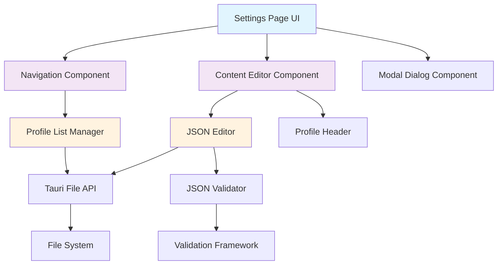
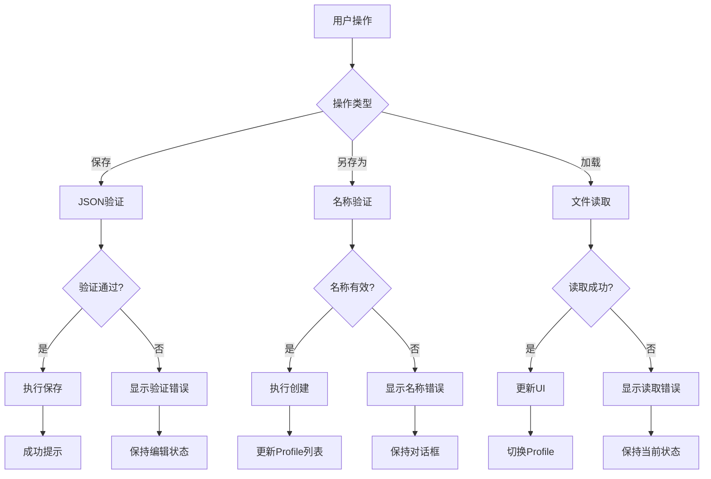

# 设计文档

## 概述

基于需求文档，我们将把现有的静态设置页面重新设计为一个动态的、支持多Profile管理的界面。新的设计采用左右分栏布局，左侧为导航菜单，右侧为内容编辑区域。该设计将充分利用现有的Tauri架构和文件系统API，提供直观的JSON编辑体验和强大的Profile管理功能。

## 架构

### 整体架构图



### 技术栈集成

- **前端**: 继续使用纯HTML/CSS/JavaScript，与现有设置页面保持一致
- **后端**: 利用现有的Tauri Rust服务，扩展文件操作功能
- **文件操作**: 基于现有的 `ConfigService` 和 `SettingsService`
- **国际化**: 扩展现有的i18n系统支持新的界面元素

## 组件和接口

### 前端组件结构

#### 1. NavigationPanel 组件
```typescript
interface NavigationItem {
  id: string;
  displayName: string;
  filePath: string;
  isActive: boolean;
  isDefault: boolean; // 用于标识Current
}

class NavigationPanel {
  private items: NavigationItem[];
  private selectedItem: string | null;
  
  // 渲染导航列表
  render(): void
  
  // 处理导航项点击
  handleItemClick(itemId: string): void
  
  // 更新选中状态的视觉效果
  updateActiveState(itemId: string): void
  
  // 刷新Profile列表
  refreshProfileList(): Promise<void>
}
```

#### 2. ContentEditor 组件
```typescript
interface EditorState {
  currentProfile: string | null;
  content: string;
  isModified: boolean;
  lastSaved: Date | null;
}

class ContentEditor {
  private state: EditorState;
  private textArea: HTMLTextAreaElement;
  private validator: JSONValidator;
  
  // 加载Profile内容
  loadProfile(profileId: string): Promise<void>
  
  // 保存当前内容
  save(): Promise<boolean>
  
  // 另存为新Profile
  saveAs(profileName: string): Promise<boolean>
  
  // 内容变化处理
  handleContentChange(): void
  
  // 渲染编辑器界面
  render(): void
}
```

#### 3. ProfileHeader 组件
```typescript
class ProfileHeader {
  private currentProfile: string | null;
  
  // 更新标题显示
  updateTitle(profileName: string): void
  
  // 渲染头部区域
  render(): void
}
```

#### 4. SaveAsModal 组件
```typescript
interface SaveAsModalOptions {
  currentContent: string;
  onSave: (profileName: string) => Promise<boolean>;
  onCancel: () => void;
}

class SaveAsModal {
  private options: SaveAsModalOptions;
  
  // 显示对话框
  show(): void
  
  // 隐藏对话框
  hide(): void
  
  // 验证Profile名称
  validateProfileName(name: string): ValidationResult
  
  // 处理保存操作
  handleSave(): Promise<void>
}
```

### 后端API扩展

基于现有的Tauri command结构，需要扩展以下API：

```rust
// 扩展现有的配置服务
impl ConfigService {
    // 获取所有Profile信息（包括Current）
    pub async fn get_all_profiles(&self) -> AppResult<Vec<ProfileInfo>>
    
    // 读取指定Profile的内容
    pub async fn read_profile_content(&self, profile_path: &str) -> AppResult<String>
    
    // 保存Profile内容
    pub async fn save_profile_content(&self, profile_path: &str, content: &str) -> AppResult<()>
    
    // 创建新Profile
    pub async fn create_profile(&self, profile_name: &str, content: &str) -> AppResult<String>
    
    // 验证Profile名称
    pub fn validate_profile_name(&self, name: &str) -> ValidationResult
}

// Tauri命令定义
#[tauri::command]
pub async fn get_profiles_list() -> Result<Vec<ProfileInfo>, String>

#[tauri::command]
pub async fn load_profile_content(profile_path: String) -> Result<String, String>

#[tauri::command]
pub async fn save_profile(profile_path: String, content: String) -> Result<(), String>

#[tauri::command]
pub async fn create_new_profile(profile_name: String, content: String) -> Result<String, String>

#[tauri::command]
pub async fn validate_json_content(content: String) -> Result<ValidationResult, String>
```

## 数据模型

### ProfileInfo 数据结构
```typescript
interface ProfileInfo {
  id: string;           // 唯一标识符
  displayName: string;  // 显示名称
  filePath: string;     // 文件路径
  isDefault: boolean;   // 是否为Current (settings.json)
  lastModified: Date;   // 最后修改时间
  fileSize: number;     // 文件大小
}
```

### ValidationResult 数据结构
```typescript
interface ValidationResult {
  isValid: boolean;
  errors: ValidationError[];
}

interface ValidationError {
  line: number;
  column: number;
  message: string;
  type: 'syntax' | 'semantic';
}
```

### UIState 数据结构
```typescript
interface UIState {
  selectedProfile: string | null;
  profiles: ProfileInfo[];
  isLoading: boolean;
  hasUnsavedChanges: boolean;
  showSaveAsModal: boolean;
  lastError: string | null;
}
```

## 错误处理

### 错误分类和处理策略

#### 1. 文件系统错误
- **读取失败**: 显示友好错误信息，提供重试选项
- **写入失败**: 保存失败时保留用户输入，提供另存为选项
- **权限错误**: 明确提示权限问题，建议解决方案

#### 2. JSON验证错误
- **语法错误**: 高亮错误位置，提供详细错误信息
- **格式错误**: 友好的错误描述，建议修正方案

#### 3. Profile管理错误
- **重名检测**: 实时验证Profile名称唯一性
- **特殊字符**: 清晰提示允许的字符范围
- **文件路径**: 处理文件路径相关的边界情况

### 错误处理工作流



## 测试策略

### 单元测试覆盖

#### 前端组件测试
1. **NavigationPanel**
   - Profile列表渲染正确性
   - 选中状态切换逻辑
   - 事件处理正确性

2. **ContentEditor**
   - 内容加载和保存流程
   - JSON验证集成
   - 修改状态跟踪

3. **SaveAsModal**
   - 名称验证逻辑
   - 用户交互流程
   - 错误处理机制

#### 后端API测试
1. **文件操作**
   - Profile读写功能
   - 错误场景处理
   - 文件系统边界情况

2. **验证框架**
   - JSON格式验证
   - Profile名称验证
   - 扩展验证规则支持

### 集成测试场景

#### 端到端工作流测试
1. **基本Profile管理流程**
   - 加载Current设置
   - 编辑并保存修改
   - 创建新Profile
   - 在Profile间切换

2. **错误场景测试**
   - 无效JSON处理
   - 文件权限问题
   - 网络/文件系统异常

3. **边界条件测试**
   - 空Profile列表
   - 大文件处理
   - 特殊字符处理
   - 并发操作场景

### 性能测试考虑

#### 关键性能指标
1. **UI响应性**
   - Profile切换延迟 < 200ms
   - 文本编辑响应延迟 < 50ms
   - 保存操作完成时间 < 1s

2. **内存使用**
   - 大JSON文件加载优化
   - 组件内存泄漏防护
   - 缓存策略有效性

3. **文件操作效率**
   - 批量Profile加载优化
   - 文件监控实现
   - 缓存失效策略

## 实现注意事项

### 用户体验优化

#### 1. 视觉设计原则
- **选中状态明显区分**: 使用背景色、边框或阴影增强选中反馈
- **Profile标识清晰**: 右侧编辑器顶部使用明显的标识区分当前编辑的Profile
- **状态反馈及时**: 保存、加载等操作提供即时的视觉反馈

#### 2. 交互体验考虑
- **防误操作**: 未保存更改时切换Profile需要确认
- **键盘支持**: 支持常用快捷键（Ctrl+S保存等）
- **加载状态**: 文件操作期间显示加载指示器

### 扩展性设计

#### 1. 验证框架扩展
- 使用策略模式支持多种验证规则
- 预留验证插件接口
- 支持异步验证流程

#### 2. UI组件模块化
- 组件间低耦合设计
- 事件驱动的通信机制
- 便于未来功能扩展

### 技术实现细节

#### 1. 文件监控
- 实现文件变更监听，自动刷新Profile列表
- 处理外部修改冲突检测

#### 2. 国际化集成
- 扩展现有i18n系统支持新界面元素
- 保持与现有设置页面的一致性

#### 3. 性能优化
- 实现Profile内容的懒加载
- 使用虚拟滚动处理大量Profile
- 优化JSON编辑器的渲染性能